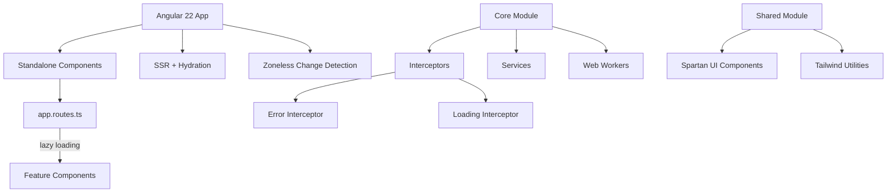
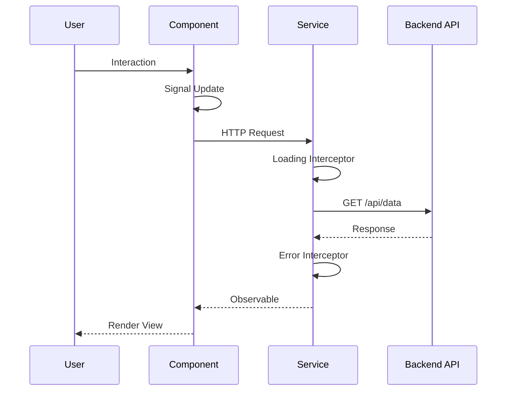
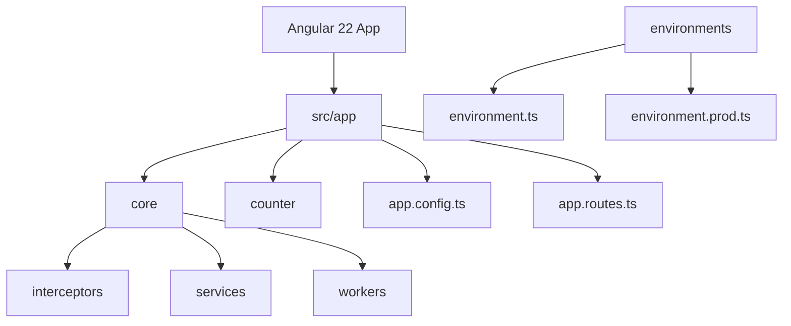

# opencode-angular

> Angular 22 + Spartan UI + Tailwind CSS 4 — Starter profissional com SSR, signals-first e tooling completo.

[](https://opensource.org/licenses/MIT)
[](https://nodejs.org/)
[](https://angular.dev/)

## Tech Stack

| Tecnologia   | Versão | Propósito           |
| ------------ | ------ | ------------------- |
| Angular      | 22.0.3 | Framework SPA + SSR |
| TypeScript   | 6.0.2  | Tipagem estática    |
| Spartan UI   | latest | UI Components       |
| Tailwind CSS | 4.3.1  | Utility-first CSS   |
| Vitest       | 4.0.8  | Testes unitários    |
| Playwright   | 1.61.0 | E2E tests           |
| ESLint       | 10.3.0 | Linting             |
| Prettier     | 3.8.1  | Formatação          |
| Husky        | 9.1.7  | Git hooks           |
| Knip         | 6.17.1 | Dead code detection |

## Arquitetura



## Fluxo da Aplicação



## Estrutura do Projeto



## Pré-requisitos

- Node.js >= 22.0.0
- npm >= 11.17.0

## Instalação

```bash
# Clone o repositório
git clone https://github.com/mmdj04/Agentwork.git
cd Agentwork

# Instale dependências
npm install

# Inicie o servidor dev
npm start
```

Acesse http://localhost:4200

## Scripts Disponíveis

| Script                   | Descrição                     |
| ------------------------ | ----------------------------- |
| `npm start`              | Servidor dev com hot reload   |
| `npm run build`          | Build produção com SSR        |
| `npm run test`           | Testes unitários com coverage |
| `npm run test:coverage`  | Coverage HTML                 |
| `npm run lint`           | ESLint                        |
| `npm run lint:fix`       | ESLint com auto-fix           |
| `npm run format`         | Prettier format               |
| `npm run format:check`   | Prettier check                |
| `npm run typecheck`      | Verificação TypeScript        |
| `npm run knip`           | Dead code detection           |
| `npm run e2e`            | Playwright E2E tests          |
| `npm run security:check` | Auditoria de segurança        |
| `npm run serve:ssr:*`    | SSR server                    |

## Estrutura de Diretórios

```
opencode-angular/
├── src/
│   ├── app/
│   │   ├── core/                    # Código compartilhado essencial
│   │   │   ├── interceptors/        # HTTP interceptors
│   │   │   ├── services/            # Serviços globais
│   │   │   └── workers/             # Web workers
│   │   ├── counter/                 # Exemplo signal-based
│   │   ├── app.config.ts            # Configuração principal
│   │   ├── app.config.server.ts     # Configuração SSR
│   │   ├── app.routes.ts            # Rotas com lazy loading
│   │   └── app.ts                   # Root component
│   ├── environments/                # Environment configs
│   ├── styles.css                   # Global styles
│   ├── main.ts                      # Bootstrap browser
│   ├── main.server.ts               # Bootstrap server
│   └── server.ts                    # Express SSR server
├── e2e/                             # Playwright tests
├── public/                          # Static assets
├── angular.json                     # Angular config
├── tsconfig.json                    # TypeScript config
├── eslint.config.js                 # ESLint config
├── prettier.config.js               # Prettier config
├── commitlint.config.js             # Commitlint config
├── knip.json                        # Knip config
├── playwright.config.ts             # Playwright config
├── postcss.config.json              # PostCSS config
├── Dockerfile                       # Docker multi-stage
├── .editorconfig                    # Editor config
├── .gitattributes                   # Git attributes
├── .gitignore                       # Git ignore
├── .npmrc                           # npm config
├── .prettierignore                  # Prettier ignore
├── .env.example                     # Environment template
├── LICENSE                          # MIT License
├── README.md                        # Este arquivo
├── CONTRIBUTING.md                  # Guia de contribuição
├── CODE_OF_CONDUCT.md               # Código de conduta
├── CHANGELOG.md                     # Histórico de versões
└── SECURITY.md                      # Política de segurança
```

## Configuração

### TypeScript (`tsconfig.json`)

- `strict: true` — Modo estrito
- `verbatimModuleSyntax` — Imports explícitos
- `declaration` + `declarationMap` — Types para libraries
- Path aliases: `@app/*`, `@env/*`, `@shared/*`, `@core/*`

### ESLint (`eslint.config.js`)

- Angular ESLint recommended
- TypeScript strict rules
- Padding-line rules para consistência
- `no-console` (warn, allow warn/error)

### Prettier (`prettier.config.js`)

- `printWidth: 100`
- `singleQuote: true`
- `trailingComma: 'all'`
- Angular HTML parser para templates

### Git Hooks (Husky)

- **pre-commit**: lint-staged (Prettier)
- **commit-msg**: commitlint (Conventional Commits)

## Convenções de Commit

| Tipo       | Descrição           | Exemplo                       |
| ---------- | ------------------- | ----------------------------- |
| `feat`     | Nova funcionalidade | `feat(auth): add login`       |
| `fix`      | Correção de bug     | `fix(api): handle null`       |
| `docs`     | Documentação        | `docs: update README`         |
| `style`    | Formatação          | `style: format code`          |
| `refactor` | Refatoração         | `refactor(service): simplify` |
| `test`     | Testes              | `test: add unit tests`        |
| `chore`    | Manutenção          | `chore: update deps`          |
| `ci`       | CI/CD               | `ci: add workflow`            |
| `perf`     | Performance         | `perf: optimize render`       |
| `build`    | Build               | `build: update config`        |

## Docker

```bash
# Build
docker build -t agentwork .

# Run
docker run -p 4000:4000 agentwork
```

## Path Aliases

Path aliases foram removidos do `tsconfig.json` para manter consistência — todos os imports usam caminhos relativos.

## Convenções de Estilo (CSS)

O projeto usa duas abordagens para estilos de componentes:

### 1. Arquivo SCSS externo (recomendado para componentes complexos)

```typescript
@Component({
  styleUrl: './app.scss',
})
```

### 2. Tailwind utilities inline (recomendado para componentes simples)

```typescript
@Component({
  template: `<div class="flex gap-4 p-4">...</div>`,
})
```

**Convenção:** Usar SCSS para componentes com estilos complexos e Tailwind utilities para estilos simples e utilitários.

## Features

- [x] Angular 22 com SSR
- [x] Zoneless change detection (signals-first)
- [x] Lazy loading de rotas
- [x] Spartan UI com 15+ helm components instalados
- [x] Tailwind CSS 4 com preset Spartan UI
- [x] Dark mode com ThemeService e persistência
- [x] HTTP interceptors (error + loading com ref-counting)
- [x] Coverage thresholds
- [x] Dead code detection (Knip)
- [x] Docker multi-stage build
- [x] Environment configs com file replacements
- [x] MCP server para documentação Spartan UI
- [x] Skill para AI assistants
- [x] Prettier com tailwind class sorting
- [x] VSCode autocomplete para classes Tailwind

## Contribuição

Veja [CONTRIBUTING.md](CONTRIBUTING.md) para detalhes.

## Licença

Este projeto está licenciado sob a MIT License — veja o arquivo [LICENSE](LICENSE) para detalhes.
